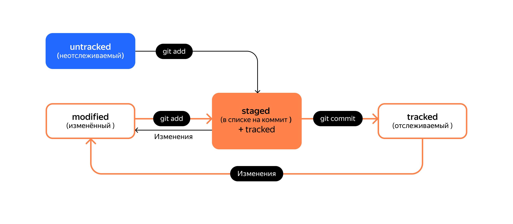

# Шпаргалка по Git.

## Начало работы.

Для начала нужно представиться:  
*`$ git config --global user.name "Your Name"`*

И указать свой email:  
*`$ git config --global user.email "your@email.com"`*  

Инициализируем репозиторий в текущей директории командой:  
*`$ git init`*

Создастся папка *`.git`*  
Если ошиблись директорией, то можно удалить репозиторий простой команду *`rm`*:  
*`$ rm -rf .git`*

Проверить состояние репозитория можно командой:  
*`$ git status`*  

В выводе будет:
* название текущей ветки
* сообщение о том есть коммиты или нет

## Состояния файла в Git:

1. Неотслеживаемое(`untracked`) состояние. Мы создали новый файл. В выводе *`$ git status`* такой файл будет в состоянии *`untracked`*. Такого файла ещё нет в коммитах.  
2. Подготовленный(`staged`) файл. Файл добавлен для внесения в репозиторий или его версии уже есть там. Команда *`git add file_name`*. После этого файл попадает в *`staging area`*  
3. Отслеживаемое(`tracked`) состояние файла. Это файлы уже добавленные в репозиторий git или зафиксированные в `staging area` с помощью команды *`git add`*.  
4. Изменённое(`modified`) состояние файла. Файл уже есть в репозитории и git нашёл отличия с сохранённой и текущей версией файла.  

### Команды для изменеия состояний файла:

1. *`$ git add file_name`*  
    или  
    *`$ git add --all`*  
    или  
    *`git add .`* -  
 эти команды нужно делать для изменения состояния `untracked` и если внесли изменения(`modified`) в отслеживаемый файл.
2. *`$ git commit -m "Описание, что добавлено и/или сделано"`* -  
     добавить файл в репозиторий.

## Добавление и синхронизация удалённых репозиториев.

Сначала нужно привязать удалённый репозиторий:  
*`$ git remote add origin git@github.com:%ИМЯ_АККАУНТА%/first-project.git`*,  
где *`origin`* - имя удалённого репозитория(историческое?). Это псевдоним, с помощью которого можно обращаться к главному удалённому репозиторию (обычно такой репозиторий один).  
*`%ИМЯ_АККАУНТА%`* - имя аккаунта на удалённом сервисе(в данном случае GitHub)  
*`first-project`* - имя проекта.

Дальше проверим, что репозиторий добавился:  
*`$ git remote -v`*  
Для синхронизации локального и удалённого репозитория нужно выполнить команду:  
*`$ git push -u origin main`*  
или  
*`$ git push -u origin master`*

## Хэш

При коммите git создаёт хеш, для этого используется алгоритм SHA-1. Хеширование преобразует набор данных в отпечаток и получается уникальный набор данных. При создании хеша используется такой набор данных о коммите: когда был сделан коммит, содержимое файлов в репозитории на момент коммита и ссылка на предыдущий или родительский коммит. Таким образом git однозначно идентифицирует коммит.

Git хранит хеши в своей таблице соответствий. По хешу можно узнать автора, дату коммита и закоммиченые файлы. Хеш - это идентификтор коммита.

Посмотреть хеши у коммитов можно с помощью команды:  
*`$ git log`*

## Лог(Log)  
Собтвенно лог(журнал) коммитов. Посмотреть можно командой:  
*`$ git log`*  
В выводе последний коммит будет на самом верху, то есть сверху вниз будет идти время в прошлое: к самому первому коммиту. В логе коммит делится на четыре строки:
1. В первой строке - хеш коммита.
2. Во второй - автор коммита.
3. В третьей - дата создания коммита.
4. В четвёртой - сообщение коммита.

Можно получить сокращённый лог. Для этого нужно добавить аргумент *`--oneline`*:  
*`$ git log --oneline`*  
Им удобно пользоваться, когда, например, очень много коммитов. В его выводе будут только сокращённые хеши и комментарии. Git сам будет сокращать хеши, чтобы они однозначано иденифицировали свои коммиты.

## HEAD  
HEAD - это указатель на самый последний коммит. Он записывается в файл HEAD в служеной директории `.git`. Внутри этого файла ссылка на `refs/heads/master` или `refs/heads/main`. Во время коммита git обновляет `refs/heads/master` и записывает в него хеш последнего коммита.  
Вместо хеша можно написать HEAD и git поймёт, что речь идёт о последнем коммите.
